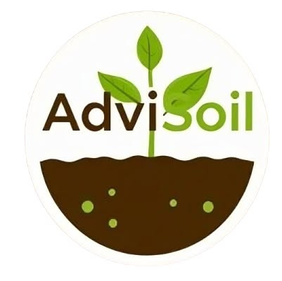
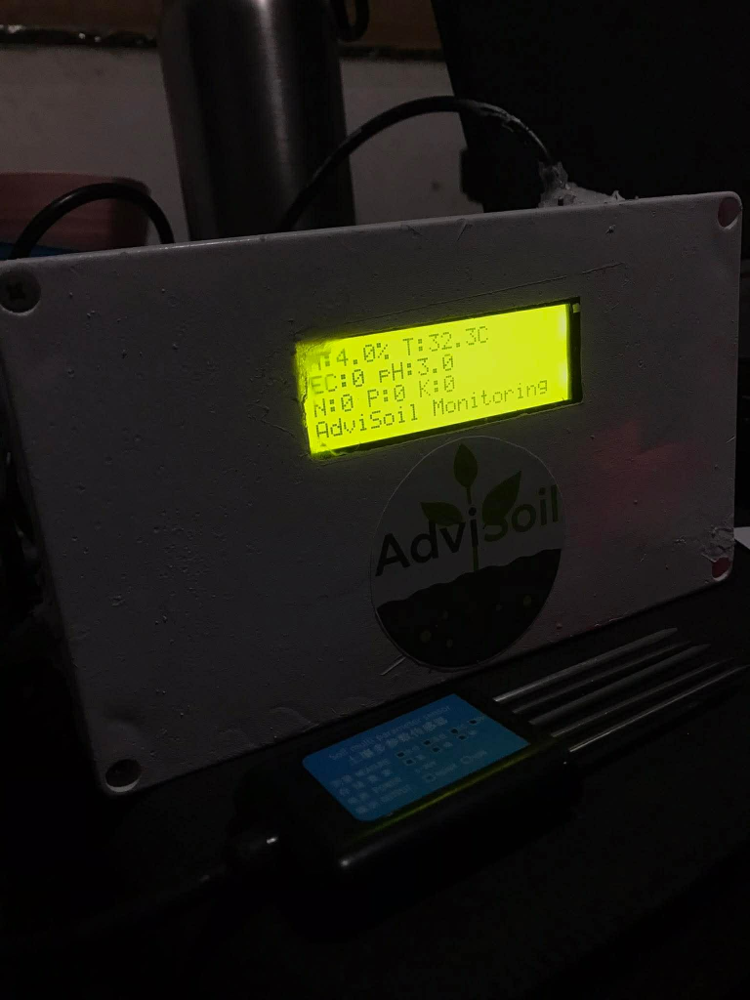
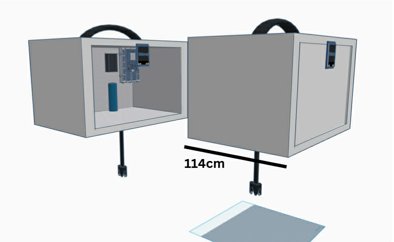
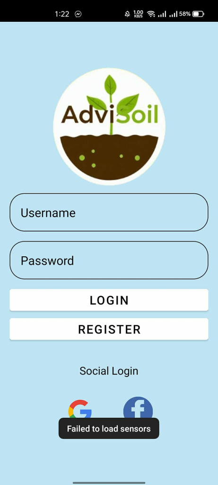
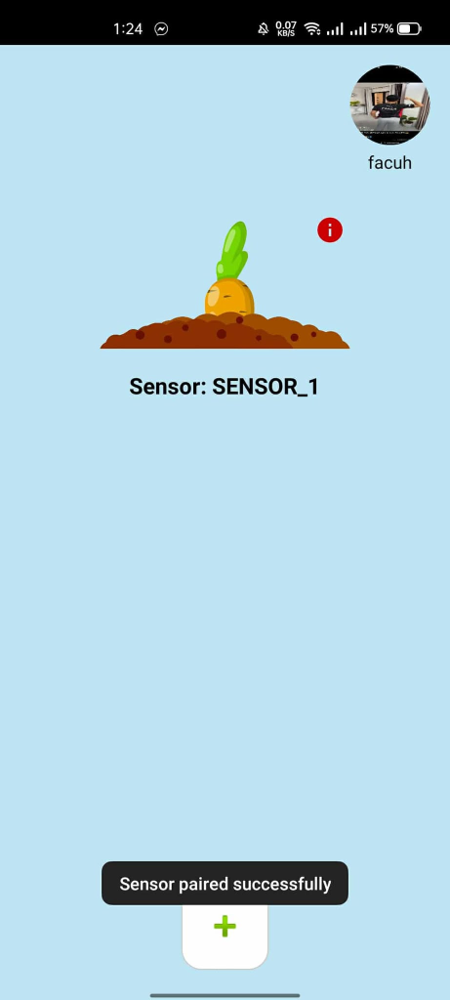
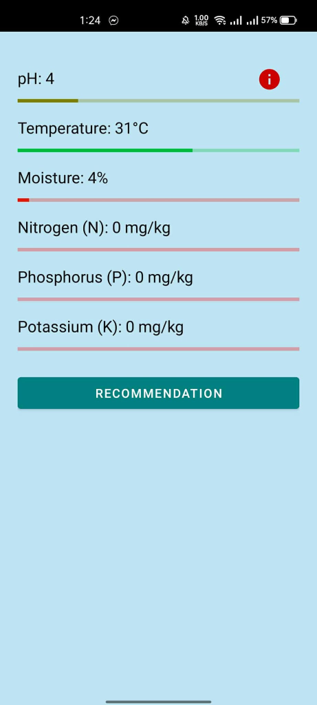
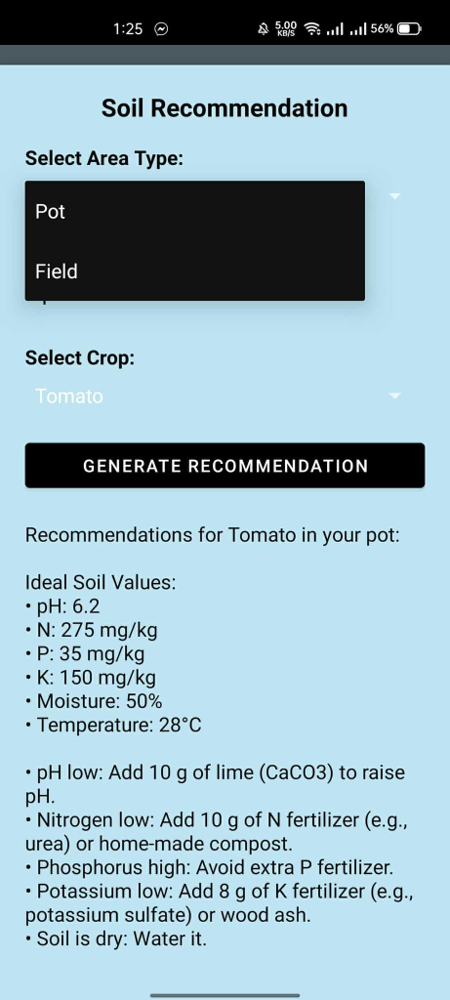
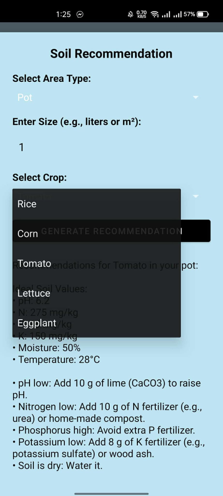
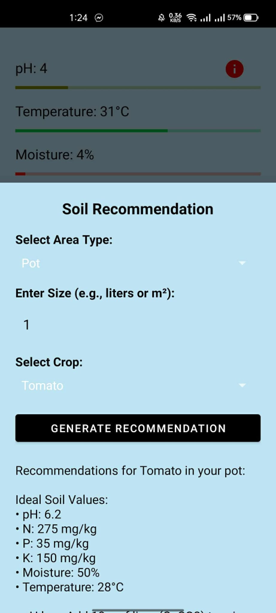

# 👋 LJ Cordova

Welcome to my GitHub profile! I'm a passionate developer building innovative solutions with modern tech stacks. This profile showcases my projects, contributions, and coding journey.

---

## 🚀 About Me

I'm a full-stack developer and cloud integrator with expertise in JavaScript, TypeScript, Python, and managing AWS/Supabase cloud infrastructure. I contribute to open-source projects and build tools that help developers work more efficiently. My focus is on database management, secure deployment pipelines, clean code, and scalability.

### Interests
- 🔧 **Backend Development** – Building robust APIs and microservices
- 🎨 **Frontend Development** – Creating responsive, modern user interfaces
- 📊 **Data & Analytics** – Visualizing and processing data at scale
- ☁️ **Cloud Architecture** – AWS, Docker, and containerization
- 🤝 **Open Source** – Contributing to the developer community

---

## 📈 GitHub Metrics

### 📌 Starred Topics

With icons

  

---

## 📅 Isometric Commit Calendar

Full year calendar

Half year calendar

---

## 🛠️ Tech Stack

  

  

  

---

## 📚 Featured Projects

### 💳 Inspire Holdings iWallet Platform
A production-grade fintech platform comprising a mobile wallet app, an administrative portal, and a secure API backend service.
*   **Backend API** ([SevenIWalletBackend](file:///c:/INSPIRE/SevenIWalletBackend)) – Built with **NestJS**, **Prisma**, and **PostgreSQL**. Handles secure ledger accounting, authentication, real-time web-socket updates, and transaction audits.
*   **Admin Portal** ([inspireadmin2](file:///c:/INSPIRE/inspireadmin2)) – Built with **Next.js 16 (App Router)** and **React 19**. Developed a secure dashboard featuring role-based access control (RBAC) to allow developers, administrators, and sales representatives to audit ledger balances and view platform analytics.
*   **Mobile Wallet** ([InspirewalletV3](file:///c:/INSPIRE/InspirewalletV3)) – Built with **Expo React Native** and **React Navigation**. Delivers a highly responsive UX for users to initiate deposits, view balances, and manage their wallets.
*   **AWS Cloud Setup & DevOps** – Managed the cloud infrastructure setup on **AWS**, configuring environment variables, secure staging deployment pipelines, and hosting.
*   **Landing Pages:** [inspirewallet.app](https://www.inspirewallet.app/) / [impay.ph](https://impay.ph/) *(Note: impay.ph is currently unavailable in the Philippines due to company request)*

---

### 🗄️ IT Asset Inventory System
A full-stack tracking and registry suite designed to monitor, audit, and log enterprise IT infrastructure hardware.
*   **Backend API** ([ITAssetBackend](file:///c:/INSPIRE/ITAssetBackend)) – Built with **NestJS**. Handles asset databases, checkout requests, and logging of hardware equipment.
*   **Admin Dashboard** ([it-asset-inventory-frontend](file:///c:/INSPIRE/it-asset-inventory-frontend)) – Built with **Next.js** and **Supabase Auth**. Web console to search, catalog, and allocate IT assets.
*   **Mobile Application** ([it-asset-inventory-mobile](file:///c:/INSPIRE/it-asset-inventory-mobile)) – Built with **Expo React Native**. Provides field technicians with a quick-scan tool to update hardware registry on the go.
*   **Supabase Database & Auth Management** – Architected and configured the **Supabase** backend, setting up database tables, schemas, Row Level Security (RLS) policies, and auth flows.

---

### 🌱 [AdviSoil](https://github.com/ljcordova13/advisoil)
An **IoT-based smart soil monitoring system** designed to help home gardeners and small-scale farmers make informed planting decisions through real-time soil analysis. The system continuously measures soil metrics and provides intelligent plant recommendations based on the collected data.

  

#### 📡 Hardware & Sensor Integration
The custom hardware unit features an **ESP32 NodeMCU** controller connected to an **RS485 6-in-1 Soil Sensor** (via a MAX485 TTL converter) to continuously collect:
*   **Chemical parameters:** Soil pH, Nitrogen (N), Phosphorus (P), Potassium (K).
*   **Physical parameters:** Soil Temperature, Soil Moisture, Electrical Conductivity (EC).

#### 📱 Software Architecture
*   **Data Pipeline:** Sensor data is transmitted via Wi-Fi from the ESP32 to **Firebase Realtime Database**.
*   **Mobile Companion:** An **Android (Java)** application retrieves the live data, supports monitoring multiple paired sensors, displays historical trends, and executes an algorithm to recommend matching plants.
*   **Alerting System:** **Firebase Cloud Messaging (FCM)** and **Cloud Functions (Python)** send push notifications to users when soil metrics go out of optimal ranges.

#### 🛠️ Technologies
`ESP32 NodeMCU` • `RS485 Soil Sensor` • `MAX485 TTL` • `Firebase Realtime DB` • `Firebase Auth` • `FCM` • `Android Studio (Java)` • `Cloud Functions (Python)`

#### 📸 Project Showcase

##### 🎛️ Hardware & Enclosure

  
  &nbsp;
  

##### 📱 Android Mobile Application

  
  &nbsp;&nbsp;&nbsp;&nbsp;
  
  &nbsp;&nbsp;&nbsp;&nbsp;
  

  
  &nbsp;&nbsp;&nbsp;&nbsp;
  
  &nbsp;&nbsp;&nbsp;&nbsp;
  

## 📞 Get in Touch

- 💼 **LinkedIn**: [LinkedIn Profile](https://www.linkedin.com/in/lj-cordova-aa0701402/)
- 📧 **Email**: [ljcordova30@gmail.com](mailto:ljcordova30@gmail.com)
- 📞 **Phone**: [09687944312](tel:09687944312)

